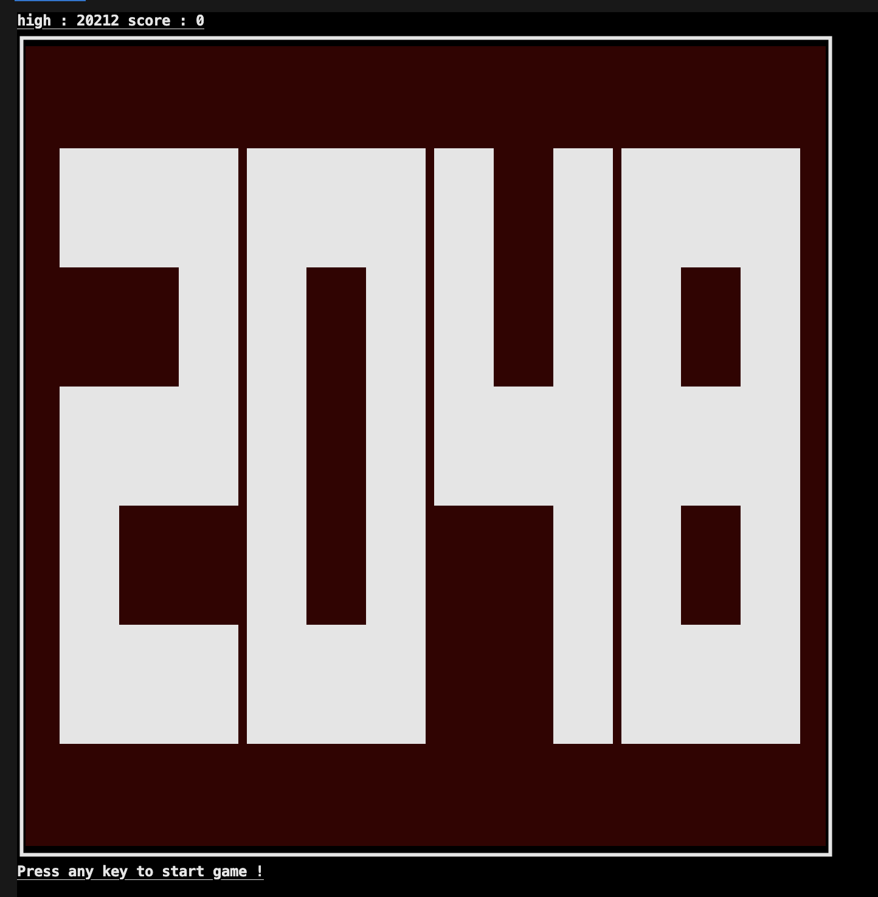
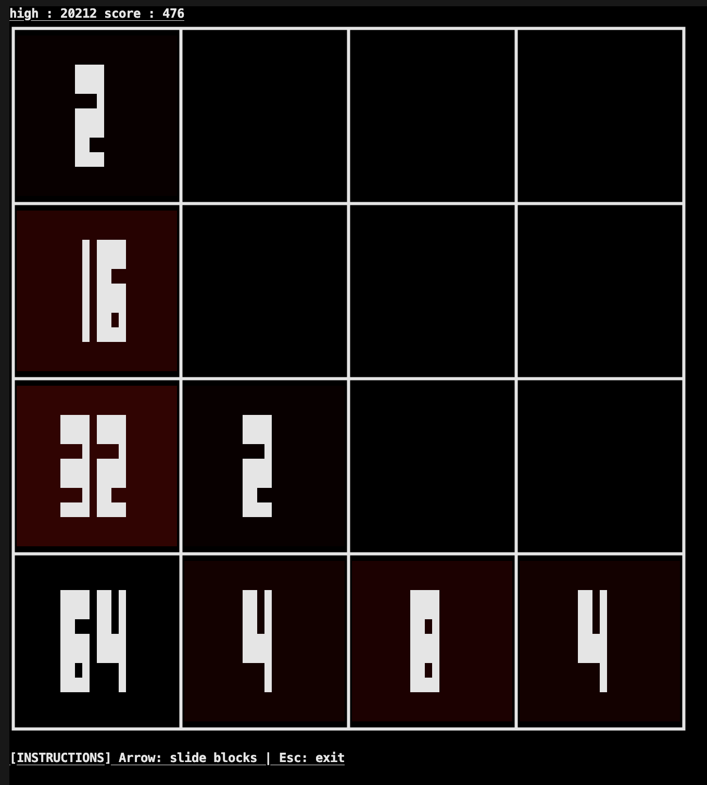
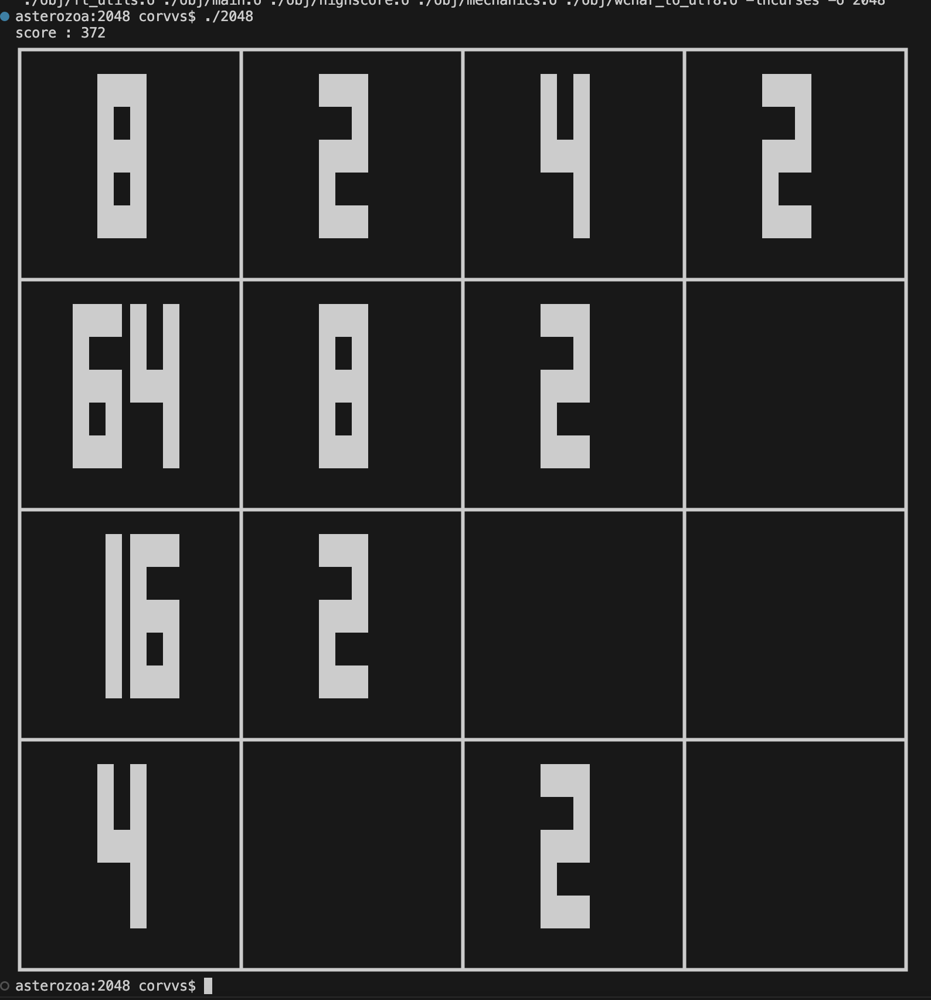

# 2048

## is 何?

みんな大好き 2048 をテキスト UI でお届けします。

## 使い方

`make bonus`すると実行ファイル`2048`ができるので, `./2048`で起動する。\
(単に`make`でもいいが, `make bonus`の方が面白いので推奨。)

あとは画面の通りにすると 2048 がプレイできる。

## スクリーンショット

### 1.起動画面

### 2. プレイ中

### 3. ゲーム終了後

